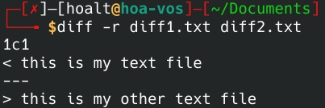

# Part 1: Basic command
## Content
---
1. <a href='#1'>View disk space.</a>
2. <a href='#2'>View disk partitions.</a>
3. <a href='#3'>View Cpu, Ram, network.</a>
4. <a href='#4'>View details process.</a>
5. <a href='#5'>List files and folders.</a>
6. <a href='#6'>Find, copy, move,...files and folders.</a>
7. <a href='#7'>Modifies file permissions basic and advanced.</a>
8. <a href='#8'>Editor vim, vi, etc.</a>
9. <a href='#9'>Mount/Unmount. </a>
10. <a href='#10'>Symbolic Links and Hard links. </a>
11. <a href='#11'> Compression and decompression.</a>
12. <a href='#12'>Tracking network traffic. </a>
13. <a href='#13'>nmap, telnet, ping, ssh, coyp file/folder from local to public host.</a>
14. <a href='#14'> Gen ssh-key.</a>
15. <a href='#15'> View file's content without open.</a>
16. <a href='#16'> Append string at the end of the file. </a>
17. <a href='#17'> Basic tools: find, grep, awk, sed, tr, head, tail, less,etc. </a>
18. <a href='#18'> Standard Input, Output, Error. </a>
19. <a href='#19'> /dev/null </a>
20. <a href='#20'> Redirecting Standard Output, Redirecting Standard Error. </a>
---

<div id='1'></div>

## 1. View disk space
Using **df** command to view all information about device.
```bash
┌─[hoalt@hoa-vos]─[~]
└──╼ $df
Filesystem     1K-blocks     Used Available Use% Mounted on
udev             3921960        0   3921960   0% /dev
tmpfs             792792     1756    791036   1% /run
/dev/dm-0      103664180 19284936  79067160  20% /
tmpfs            3963956   206016   3757940   6% /dev/shm
tmpfs               5120        4      5116   1% /run/lock
/dev/sda4         510952      244    510708   1% /boot/efi
tmpfs             792788      124    792664   1% /run/user/1000
/dev/sda2      524287996 34665140 489622856   7% /media/hoalt/Data
/dev/sda3      346030076 10702676 335327400   4% /media/hoalt/Other
```

Using **df -h** command to view disk's size with readable type(megabyte or gigabyte instead of byte).
```bash
┌─[hoalt@hoa-vos]─[~]
└──╼ $df -h
Filesystem      Size  Used Avail Use% Mounted on
udev            3,8G     0  3,8G   0% /dev
tmpfs           775M  1,8M  773M   1% /run
/dev/dm-0        99G   19G   76G  20% /
tmpfs           3,8G  200M  3,6G   6% /dev/shm
tmpfs           5,0M  4,0K  5,0M   1% /run/lock
/dev/sda4       499M  244K  499M   1% /boot/efi
tmpfs           775M  124K  775M   1% /run/user/1000
/dev/sda2       500G   34G  467G   7% /media/hoalt/Data
/dev/sda3       330G   11G  320G   4% /media/hoalt/Other
```

**df** command allow user to combine different options to achieve best result.

*Example*: **df -Th** uses to check type of files system are using and allow viewing disk's size with readable type(megabyte or gigabyte instead of byte).
```bash
┌─[✗]─[hoalt@hoa-vos]─[~]
└──╼ $df -Th
Filesystem     Type      Size  Used Avail Use% Mounted on
udev           devtmpfs  3,8G     0  3,8G   0% /dev
tmpfs          tmpfs     775M  1,8M  773M   1% /run
/dev/dm-0      ext4       99G   19G   76G  20% /
tmpfs          tmpfs     3,8G  200M  3,6G   6% /dev/shm
tmpfs          tmpfs     5,0M  4,0K  5,0M   1% /run/lock
/dev/sda4      vfat      499M  244K  499M   1% /boot/efi
tmpfs          tmpfs     775M  124K  775M   1% /run/user/1000
/dev/sda2      fuseblk   500G   34G  467G   7% /media/hoalt/Data
/dev/sda3      fuseblk   330G   11G  320G   4% /media/hoalt/Other
```
Furthermore, user can view all the usage's options by **df --help**.
```bash
┌─[hoalt@hoa-vos]─[~]
└──╼ $df --help
Usage: df [OPTION]... [FILE]...
Show information about the file system on which each FILE resides,
or all file systems by default.

Mandatory arguments to long options are mandatory for short options too.
  -a, --all             include pseudo, duplicate, inaccessible file systems
  -B, --block-size=SIZE  scale sizes by SIZE before printing them; e.g.,
                           '-BM' prints sizes in units of 1,048,576 bytes;
                           see SIZE format below
  -h, --human-readable  print sizes in powers of 1024 (e.g., 1023M)
  -H, --si              print sizes in powers of 1000 (e.g., 1.1G)
  -i, --inodes          list inode information instead of block usage
  -k                    like --block-size=1K
  -l, --local           limit listing to local file systems
      --no-sync         do not invoke sync before getting usage info (default)
      --output[=FIELD_LIST]  use the output format defined by FIELD_LIST,
                               or print all fields if FIELD_LIST is omitted.
  -P, --portability     use the POSIX output format
      --sync            invoke sync before getting usage info
      --total           elide all entries insignificant to available space,
                          and produce a grand total
  -t, --type=TYPE       limit listing to file systems of type TYPE
  -T, --print-type      print file system type
  -x, --exclude-type=TYPE   limit listing to file systems not of type TYPE
  -v                    (ignored)
      --help     display this help and exit
      --version  output version information and exit

Display values are in units of the first available SIZE from --block-size,
and the DF_BLOCK_SIZE, BLOCK_SIZE and BLOCKSIZE environment variables.
Otherwise, units default to 1024 bytes (or 512 if POSIXLY_CORRECT is set).

The SIZE argument is an integer and optional unit (example: 10K is 10*1024).
Units are K,M,G,T,P,E,Z,Y (powers of 1024) or KB,MB,... (powers of 1000).
Binary prefixes can be used, too: KiB=K, MiB=M, and so on.

FIELD_LIST is a comma-separated list of columns to be included.  Valid
field names are: 'source', 'fstype', 'itotal', 'iused', 'iavail', 'ipcent',
'size', 'used', 'avail', 'pcent', 'file' and 'target' (see info page).

GNU coreutils online help: <https://www.gnu.org/software/coreutils/>
Full documentation <https://www.gnu.org/software/coreutils/df>
or available locally via: info '(coreutils) df invocation'
```
---

<div id="2"></div>

## 2. View disk partitions.

**fdisk** allows user view, create, change size, remove, modify, copy and move partitios.

Using command **sudo fdisk -l** to view all partitions on your device.
```bash
┌─[hoalt@hoa-vos]─[~]
└──╼ $sudo fdisk -l
[sudo] password for hoalt: 
Disk /dev/sda: 931,51 GiB, 1000204886016 bytes, 1953525168 sectors
Disk model: WDC WD10SPZX-75Z
Units: sectors of 1 * 512 = 512 bytes
Sector size (logical/physical): 512 bytes / 4096 bytes
I/O size (minimum/optimal): 4096 bytes / 4096 bytes
Disklabel type: gpt
Disk identifier: A8F28817-479C-48E5-BA5C-5410BE128C6D

Device          Start        End    Sectors  Size Type
/dev/sda1          34      32767      32734   16M Microsoft reserve
/dev/sda2       32768 1048608767 1048576000  500G Microsoft basic d
/dev/sda3  1048608768 1740668927  692060160  330G Microsoft basic d
/dev/sda4  1740668928 1741692927    1024000  500M Microsoft basic d
/dev/sda5  1741692928 1953525134  211832207  101G Linux filesystem

Partition 1 does not start on physical sector boundary.


Disk /dev/mapper/luks-0fbfd3e2-ec72-4f77-a00f-2c986560d2a9: 101,01 GiB, 108455992832 bytes, 211828111 sectors
Units: sectors of 1 * 512 = 512 bytes
Sector size (logical/physical): 512 bytes / 4096 bytes
I/O size (minimum/optimal): 4096 bytes / 4096 bytes
```
User can view specific partition by: **fdisk -l *<partition's name>***
```bash
┌─[hoalt@hoa-vos]─[~]
└──╼ $sudo fdisk -l /dev/sda3
Disk /dev/sda3: 330 GiB, 354334801920 bytes, 692060160 sectors
Units: sectors of 1 * 512 = 512 bytes
Sector size (logical/physical): 512 bytes / 4096 bytes
I/O size (minimum/optimal): 4096 bytes / 4096 bytes
Disklabel type: dos
Disk identifier: 0x73736572

Device      Boot      Start        End    Sectors   Size Id Type
/dev/sda3p1      1920221984 3736432267 1816210284   866G 72 unknown
/dev/sda3p2      1936028192 3889681299 1953653108 931,6G 6c unknown
/dev/sda3p3               0          0          0     0B  0 Empty
/dev/sda3p4        27722122   27722568        447 223,5K  0 Empty
```
---
<div id="3"></div>

## 3. View Cpu, Ram, network.

### 3.1 Cpu
Cpu's information is saved in **/proc/cpuinfo**.

To view this file, we use: **cat /proc/cpuinfo**.

There are bunch of information appear, to be more clear, we can combine with **grep** to get specific information such as vendor name, model name, processsors, core, etc.

Those commands are:

* **cat /proc/cpuinfo | grep ‘vendor’ | uniq**
* **cat /proc/cpuinfo | grep ‘model ’ | uniq**
* **cat /proc/cpuinfo | grep ‘processsor’ | wc -l**
* **cat /proc/cpuinfo | grep ‘core id’**

### 3.2 RAM
Command: **free -m**
```bash
┌─[hoalt@hoa-vos]─[~]
└──╼ $free -m
               total        used        free      shared  buff/cache   available
Mem:            7742        3836         578        1281        3327        2370
Swap:              0           0           0
```
### 3.3 Network
To view and monitor incoming and outgoing packet statistic and interface statistic, using command: **netstat**.

There are bunch of information will appear in you screen.

```bash
┌─[hoalt@hoa-vos]─[~]
└──╼ $netstat
Active Internet connections (w/o servers)
Proto Recv-Q Send-Q Local Address           Foreign Address         State      
tcp        0      0 192.168.0.103:42454     20.185.212.106:https    ESTABLISHED
tcp        0      0 192.168.0.103:55910     tp-in-f188.1e100.n:5228 ESTABLISHED
tcp        0      0 192.168.0.103:36322     n29-03-09-vip.lb.:https CLOSE_WAIT 
tcp        0      0 192.168.0.103:34503     52.163.231.110:https    ESTABLISHED
tcp        0      0 192.168.0.103:50230     13.76.217.211:https     ESTABLISHED
tcp        0      0 192.168.0.103:43770     20.185.212.106:https    ESTABLISHED
tcp       25      0 192.168.0.103:36320     n29-03-09-vip.lb.:https CLOSE_WAIT 
tcp        0      0 192.168.0.103:57678     lb-140-82-112-26-:https ESTABLISHED
tcp        0      0 192.168.0.103:46674     192.229.232.200:https   ESTABLISHED
tcp        0      0 192.168.0.103:48112     ec2-44-231-10-174:https ESTABLISHED
tcp        0      0 192.168.0.103:36126     hkg12s32-in-f14.1:https TIME_WAIT  
tcp        0      0 192.168.0.103:41318     140.227.186.35.bc:https TIME_WAIT  
tcp        0      0 192.168.0.103:55792     91.108.56.196:https     ESTABLISHED
udp        0      0 192.168.0.103:bootpc    192.168.0.1:bootps      ESTABLISHED
Active UNIX domain sockets (w/o servers)
Proto RefCnt Flags       Type       State         I-Node   Path
unix  2      [ ]         DGRAM                    25173    /run/user/1000/systemd/notify
unix  2      [ ]         DGRAM                    10904    /run/wpa_supplicant/wlan0
unix  3      [ ]         SEQPACKET  CONNECTED     28981    @0000d
unix  3      [ ]         SEQPACKET  CONNECTED     28983    @0000e
unix  4      [ ]         DGRAM                    13949    /run/systemd/notify
unix  2      [ ]         DGRAM                    13966    /run/systemd/journal/syslog
unix  20     [ ]         DGRAM                    13972    /run/systemd/journal/dev-log
unix  6      [ ]         DGRAM                    13974    /run/systemd/journal/socket
unix  3      [ ]         SEQPACKET  CONNECTED     53997    @00016
unix  3      [ ]         SEQPACKET  CONNECTED     50051    @00015
unix  3      [ ]         SEQPACKET  CONNECTED     45595    @00014
unix  3      [ ]         SEQPACKET  CONNECTED     45593    @00013
unix  3      [ ]         SEQPACKET  CONNECTED     117887   
unix  3      [ ]         STREAM     CONNECTED     48488    
unix  3      [ ]         STREAM     CONNECTED     28976    /run/user/1000/bus
unix  3      [ ]         STREAM     CONNECTED     24380    
unix  3      [ ]         STREAM     CONNECTED     27866    @/tmp/.X11-unix/X0
unix  3      [ ]         STREAM     CONNECTED     54485    
unix  3      [ ]         STREAM     CONNECTED     52982    
unix  3      [ ]         STREAM     CONNECTED     50793    
unix  3      [ ]         STREAM     CONNECTED     44949    
unix  3      [ ]         STREAM     CONNECTED     11194    /run/user/1000/bus
unix  3      [ ]         STREAM     CONNECTED     57361    
unix  3      [ ]         STREAM     CONNECTED     28792    
unix  3      [ ]         STREAM     CONNECTED     117888   
unix  3      [ ]         STREAM     CONNECTED     29835    
unix  3      [ ]         STREAM     CONNECTED     61114    
unix  3      [ ]         STREAM     CONNECTED     44987    
unix  3      [ ]         STREAM     CONNECTED     28052    
unix  3      [ ]         STREAM     CONNECTED     50128    
unix  3      [ ]         STREAM     CONNECTED     46302    
unix  3      [ ]         STREAM     CONNECTED     29125    
unix  3      [ ]         STREAM     CONNECTED     49490    
unix  3      [ ]         SEQPACKET  CONNECTED     24551    
unix  3      [ ]         STREAM     CONNECTED     28114    
unix  3      [ ]         STREAM     CONNECTED     29980    
unix  3      [ ]         STREAM     CONNECTED     11141    
unix  3      [ ]         STREAM     CONNECTED     61127    
unix  3      [ ]         STREAM     CONNECTED     50085    @/tmp/.X11-unix/X0
```
---
<div id="4"></div>

## 4. View details process.
User can use "System Monitor" to view all processeses, ram, cpu, network GUI.


Furthermore, **ps aux** allows user track all processes are running in detail.
```bash
┌─[hoalt@hoa-vos]─[~]
└──╼ $ps aux
USER         PID %CPU %MEM    VSZ   RSS TTY      STAT START   TIME COMMAND
root           1  0.0  0.1 164244 10708 ?        Ss   15:23   0:01 /sbin/init splash noautomount splash
root           2  0.0  0.0      0     0 ?        S    15:23   0:00 [kthreadd]
root           3  0.0  0.0      0     0 ?        I<   15:23   0:00 [rcu_gp]
root           4  0.0  0.0      0     0 ?        I<   15:23   0:00 [rcu_par_gp]
root           6  0.0  0.0      0     0 ?        I<   15:23   0:00 [kworker/0:0H-events_highpri]
root           9  0.0  0.0      0     0 ?        I<   15:23   0:00 [mm_percpu_wq]
root          10  0.0  0.0      0     0 ?        S    15:23   0:00 [rcu_tasks_rude_]
root          11  0.0  0.0      0     0 ?        S    15:23   0:00 [rcu_tasks_trace]
root          12  0.0  0.0      0     0 ?        S    15:23   0:00 [ksoftirqd/0]
root          13  0.1  0.0      0     0 ?        I    15:23   0:08 [rcu_sched]
root          14  0.0  0.0      0     0 ?        S    15:23   0:01 [migration/0]
root          15  0.0  0.0      0     0 ?        S    15:23   0:00 [cpuhp/0]
root          16  0.0  0.0      0     0 ?        S    15:23   0:00 [cpuhp/1]
root          17  0.0  0.0      0     0 ?        S    15:23   0:01 [migration/1]
root          18  0.0  0.0      0     0 ?        S    15:23   0:00 [ksoftirqd/1]
root          20  0.0  0.0      0     0 ?        I<   15:23   0:00 [kworker/1:0H-events_highpri]
root          21  0.0  0.0      0     0 ?        S    15:23   0:00 [cpuhp/2]
root          22  0.0  0.0      0     0 ?        S    15:23   0:00 [migration/2]
root          23  0.0  0.0      0     0 ?        S    15:23   0:00 [ksoftirqd/2]
root          25  0.0  0.0      0     0 ?        I<   15:23   0:00 [kworker/2:0H-events_highpri]
root          26  0.0  0.0      0     0 ?        S    15:23   0:00 [cpuhp/3]
root          27  0.0  0.0      0     0 ?        S    15:23   0:01 [migration/3]
root          28  0.0  0.0      0     0 ?        S    15:23   0:00 [ksoftirqd/3]
root          30  0.0  0.0      0     0 ?        I<   15:23   0:00 [kworker/3:0H-events_highpri]
root          31  0.0  0.0      0     0 ?        S    15:23   0:00 [cpuhp/4]
root          32  0.0  0.0      0     0 ?        S    15:23   0:01 [migration/4]
root          33  0.0  0.0      0     0 ?        S    15:23   0:00 [ksoftirqd/4]
root          35  0.0  0.0      0     0 ?        I<   15:23   0:00 [kworker/4:0H-events_highpri]
root          36  0.0  0.0      0     0 ?        S    15:23   0:00 [cpuhp/5]
root          37  0.0  0.0      0     0 ?        S    15:23   0:01 [migration/5]
root          38  0.0  0.0      0     0 ?        S    15:23   0:00 [ksoftirqd/5]
```
---
<div id="5"></div>

## 5.List files and folders.
Command: **ls**: list all file and folder in current directory.

```bash
┌─[hoalt@hoa-vos]─[~]
└──╼ $ls
Desktop  Documents  Downloads  Music  Pictures  Public  Templates  Videos
```
---

<div id="6"></div>

## 6. Find, copy, move,...files and folders.
Command:

* Find: **find *\<directory>* *\<option>* *\<filename>***
```bash
┌─[hoalt@hoa-vos]─[~]
└──╼ $find . -name "testfile.txt"
./testfile.txt
```
* Copy: **cp *\<filename>* *\<destination>***
```bash
┌─[✗]─[hoalt@hoa-vos]─[~]
└──╼ $cp testfile.txt Documents/
```
* Move: **mv *\<filename>* *\<destination>***
```bash
┌─[hoalt@hoa-vos]─[~]
└──╼ $mv testfile.txt Downloads/
┌─[hoalt@hoa-vos]─[~]
```
* Create directory: **mkdir *\<directory name>***
```bash
┌─[hoalt@hoa-vos]─[~/Documents]
└──╼ $mkdir testfolder
┌─[hoalt@hoa-vos]─[~/Documents]
└──╼ $ls
 Begin_Task   testfile.txt   testfolder  'Untitled 1.odt'
┌─[hoalt@hoa-vos]─[~/Documents]
```
* Create file: **touch *\<filename>***
```bash
┌─[hoalt@hoa-vos]─[~]
└──╼ $touch testfile.txt
```
* Remove file: **rm *\<filename>***
```bash
┌─[hoalt@hoa-vos]─[~/Documents]
└──╼ $ls
 Begin_Task   testfolder  'Untitled 1.odt'
 ```
 * Remove directory: **rmdir *\<filename>***
 ```bash
 ┌─[hoalt@hoa-vos]─[~/Documents]
└──╼ $ls
 Begin_Task  'Untitled 1.odt'
┌─[hoalt@hoa-vos]─[~/Documents]
```
---

<div id="7"></div>

## 7. Modifies file permissions basic and advanced.

There are two types of object in Linux:

- Owner
- Group owner
- Other users

Permissions:

- Read - r - 4
- Write - w - 2
- Execute - x - 1

Only user have root permission or owner can change permissions of that file.

Command: **chmod *\<mode>* *\<filename>***

Mode can be writte by symbolic or octal mode.

*a. Symbolic*

In this mode, we can add (+), remove (-), asign (+) permissions (r w x) for each group (o u g) or all (a).

The advantage of this mode is we **can inherit old permission**.

Example:


*b. Octal mode*

Permission will be asign for total of each group, Ex: r(4) + w(2) + x(1) = 7.

We must asign for all three group.

Example:


- Command: **chown** used to change the owner.


- Command: **chgrp** used to change the owner.


---
<div id="8"></div>

## 8. Editor vim, vi, etc.

To open a file with vi/vim, we use this command
```bash
vim <filename>
```


- There are two common types of mode in vi: **insert** and **command line**

    - Press "i" to enter **insert** mode
    - Press "Esc" to enter **command line** mode

- Some common command in **command line** mode:

    - Exit vi/vim: **:q**
    - Save: **:w**
    - Save and exit: **:wq**
    - No save and exit: **:q!**
    - Delete a row: **dd**
    - Delete a word: **dw**
    - Delete two word: **d2w**
    - Copy a row: **yy** or **Y**
    - Find forward: **/\<word>**

---

<div id="9"></div>
## 9. Mount/Unmount.

Mount a device: 
```bash
mount -t <type> -o <option> <device file> <mount point>
```

Example: 
```bash
mount -t ext4 -o defaults /dev/sdb2 /home/mnt/
```

Unmount a device: 
```bash
umount /dev/sdb1
```
**Remember *umount* (not unmount)**

Or you can use this command:
```bash
umount /home/mnt
```

---

<div id="10"></div>

## 10. Symbolic Links and Hard links.

### 1. Symbolic Link
> A symlink (also called a symbolic link) is a type of file in Linux that points to another file or a folder. Symlinks are similar to shortcuts in Windows.

The syntax for creating a symlink:
```bash
ln -s <path to the file/folder to be linked> <the path of the link to be created>
```


There are many ways to remove a symlink:
```bash
ls -l <path-to-assumed-symlink>
```
```bash
unlink <path-to-symlink>
```
```bash
rm <path-to-symlink>
```


### 2. Hard Link
>A hard link is a file that points to the same underlying inode, as another file. In case you delete one file, it removes one link to the underlying inode.

The syntax for creating a hard link:
```bash
ln <path to the file/folder to be linked> <the path of the link to be created>
```

There are many ways to remove a symlink:
```bash
unlink <path-to-hardlink>
```
```bash
rm <path-to-hardlink>
```
### 3. Compare Syslink and Hard Link

| Parameters | Hard link | Soft link |
| --- | --- | --- |
| Inode | Files that are hard linked take the same inode number. | Files that are soft linked take a different inode number. |
| Directories | not allowed for directories.(Only a superuser can do it) | Soft links can be used for linking directories. |
| File system | It cannot be used across file systems. | It can be used across file systems. |
| Data | Data present in the original file will still be available in the hard links.| Soft links only point to the file name it does not retain data of the file. |
| Original file’s deletion | The link will still work as it accesses the data the original was having access to. | The link will not work as it doesn’t access the original file’s data. |
| Speed | Faster. | Comparatively slower. |

---

<div id="11"></div>

## 11. Compression and decompression.
> Some type of compression: .gz, .tar, .zip, .tar.gz, tar.bz2.
---
 > .gz
```bash
Compression: gzip [filename]
Decompression: gunzip [filename]
```
> .tar
```bash
Compression: tar -zcvf [file.tar.gz] file1 file2 …
Decompression: tar -zxvf [file.tar.gz]
```
> .zip
```bash
Compression: zip -r folder.zip folder
Decompression: unzip file.zip
```
> .tar.gz
```bash
Compression: tar -zcf folder.tar.gz folder
Decompression: tar -zxvf file.tar.gz
```
>tar.bz2
```bash
Compression: tar -jcf folder.tar.bz2 folder
Decompression: tar -jxvf file.tar.bz2
```
---
 <div id="12"></div>

 ## 12. Tracking network traffic.

> vnstat command is a console-based network traffic monitor. It keeps a log of hourly, daily and monthly network traffic for the selected interface.

> The traffic information is analyzed from the proc filesystem. That way vnStat can be used even without root permissions.

After installation, vnstat will be run in Interface eth0. If your device is not eth0, you should change Network Interface in file config.
```bash
vi /etc/vnstat.conf
```
Enter your network interface to **Interface** line


Command:
```bash
vnstat -i {interface} -option1 -option2...
```
There are a lot of options available for user:
- -q: query DB
- -h: Display hourly
- -d: Display daily
- -m: Display monthly
- -w: Display weekly
- -t: Display first 10 days
- -s: Show output
- -u: Update DB
- -i: Choose interface (default eth0)
- -?: Help
- -v: Check version
- -tr: Caculate traffic
- -ru: swap configured rate unit
- -l: Display speed in real time

For example:
> View daily


>View Hourly


> You can use vnstati tool to creat graphic view

Command:
```bash
vnstati -s -i <network interface> -o <where to save picture>
```


> Result


---

<div id="13">

## 13. nmap, telnet, ping, ssh, coyp file/folder from local to public host.

### 1. nmap
> Nmap is used to discover hosts and services on a computer network by **sending packets** and **analyzing the responses**.

>Nmap provides **a number of features** for probing computer networks, including host discovery and service and operating system detection.

Basic Commad:
```bash
nmap <options> <target>
```

Common options:

| Option | Usage |
| --- | --- |
| -sS | TCP syn port scan |
| -sT | TCP connect port scan |
| -sU | UDP port scan |
| -sA | TCP ack port scan |
| -Pn | only port scan |
| -sn | only host discover |
| -n | disable DNS resolution	 |
| -p | specify a port or port range |
| -p- | scan all ports |
| -F | fast port scan |
| -sV | detect the version of services running |
| -A | aggressive scan |
| -O | detect operating system of the target |

>Example

Specify a port or port range


Detect operating system of the target


Only port discover


Detect the version of services running


### 2. telnet
> Telnet is an **application protocol** used on the Internet or local area network to provide a bidirectional interactive text-oriented communication facility using a virtual terminal connection.

---

<div id="15"></div>

## 15. View file's content without open.

Command:
```bash
cat <filename>
```


---
<div id="15"></div>

## 16. Append string at the end of a file.

> There are many ways to append file:

1. echo
```bash
echo <content> >> <filename>
```


2. cat
```bash
cat <filename > <filename>
```


3. tee
```bash
cat <filename > | tee -a <filename>
```


---

<div id="17"></div>

## 17. Basic tools: awk, sed, tr, head, tail, less, more, sort, uniq, cut, join, diff, xargs, traceroute, kill, pkill, wc, wget, git.

### 1. awk:
> Awk is a scripting language used for manipulating data and generating reports.

> Command:
```bash
awk <pattern> <actions> <filename>
```
This command can be missed either **pattern** or **actions** operator, but it could not miss both.

By default, **awk** will print a single line of specific file.


> There are a lot of ways to use **awk**, so feel free to check them out [here](https://linuxize.com/post/awk-command/).

### 2. sed

>SED command in UNIX is stands for stream editor and it can perform lot’s of function on file like, searching, find and replace, insertion or deletion.

>Though most common use of SED command in UNIX is for substitution or for find and replace.

>**You can edit files even without opening it, which is much quicker way to find and replace something in file like other text editor(vi, vim, nano).**

Command:
| Command | Usage |
| --- | --- |
| sed 's/old_text/new_text/' filename | Replacing or substituting string |
|sed 's/old_text/new_text/g' filename | Replacing all the occurrence of the old_text in a line | 
| sed '1,3 s/old_text/new_text/' filename | Replacing string on a range of lines |
| sed 's/old_text/new_text/p' filename | Duplicating the replaced line with /p flag |
| sed -n 's/old_text/new_text/p' filename | Printing only the replaced lines |
| sed -i s/old_text/new_text/g filename | Save changes to replace strings in the same file |

> **Be careful when using this command with **-i** option. Because it is not possible to return to the state before the **-i** option is executed.**

> To be safe, use the sed command without the -i option and then replace the new file, like in the following example:
```bash
sed 's/old_text/new_text/g' filename1 > filename2
```


### 2. tr
> The tr command in UNIX is a command line utility for translating or deleting characters.

> **Remember those changes are just appear in the screen, the file is not changes itself.**

Command:
```bash
tr <OPTION> <SET> <SET2>
```
Common options:

| Option | Usage |
| --- | --- |
| -c | complements the set of characters in string.i.e., operations apply to characters not in the given set. |
| -d | delete characters in the first set from the output. |
| -s | replaces repeated characters listed in the set1 with single occurrence. |
| -t | truncates set1 |

Example:
> Convert lower case to upper case
```bash
tr "[a-z]" "[A-Z]
```


> Repeat occurrences of characters specified in a set
```bash
tr -s [:space:] ' '
```


> Delete specified characters using -d option
```bash
tr -d <character>
```


### 3. more, less, head, tail

- more: to view a text file one page at a time, press spacebar to go to the next page.

> **more filename** : show the document one page at a time.

> **more -num filename** : show the document page few lines as specified bu (-num).


- less: is much the same as more command except.

> You can navigate the page up/down using the less command and not possible in more command.

>You can navigate the page up/down using the less command and not possible in more command.


- head: displays the first ten lines of a file, unless otherwise stated.


> **head -n filename** : display the first n lines of the file.


- tail: display the last part of the file.


> **tail -n filename** : display the last n lines of the file.


### 4. sort, uniq, join

> The **sort** command is used to sort the lines of a text file in ascending or descending order, according to a sort key.
```bash
sort <option> <filename>
```
option:

- sort \<filename>: Sort the lines in the file, by the characters at the beginning of each line.


- sort -r \<filename>: Sort the lines in reverse order.


> The uniq command to remove duplicate consecutive lines in a text file is useful for simplifying the display of text.

> The uniq command requires duplicate lines to be consecutive, so we usually run sort first. 

```bash
uniq <option> <filename>
```

Option can be omitted in basic usage.

Remember to **sort** file before run **uniq**.


Options:

- -c: count
- -d: repeated
- -d: all-repeated
- -u: unique
- -i: ignore-case
- -f: skip-fields=N
- -s: skip-char=N
- -w: check-chars=N

>  The **join** command to join lines of two files on a common field.

Command:
```bash
join <filename1> <filename2>
```


### 5. diff, xargs, wc, wget, git
> The command diff is used to compare FILES line by line.

Command:
```bash
diff <option> <filename> <filename>
```

option can be omitted

Some common options:

- -q: report only when files differ.
- -s: report when two files are the same.
- -y: compare line by line
- -i: ignore case differences in file contents.
- -E; ignore changes due to tab expanssion.
- -Z: ignore white space at line end.
- -b: ignore changes in the amount of white space.
- -w: ignore all white space.
- -B: ignore changes where lines are all blank.
- -a: treat all files as text.

Example:


> xargs is used to build and execute command lines from standard input.

Command:
```bash
xargs <option> <command [initial-arguments]>
```
Some common options;

- -a: Read names from the file inputfile instead of standard input.
- -0: Input file names are terminated by a **null** character instead of by whitespace, and any quotes and backslash characters are not considered special.
- -d: Input file **names** are terminated by the specified character delim instead of by whitespace, and any quotes and backslash characters are not considered special.
- -e: Set the logical end of file marker string to eof-str. If the logical end of file marker string occurs as a line of input, the rest of the input is ignored.
- -i: Replace occurrences of replace-str in the initial arguments with names read from standard input.
- -l: Use at most max-lines non-blank input lines per command line. 
- -s: Use at most max-chars characters per command line, including the command, initial arguments and any terminating nulls at the ends of the argument strings.
- -t: Print the command line on the standard error output before executing it.
- x: Exit if the size (see the ‘-s’ option) is exceeded.

Example:
> **xargs** with **echo**


> **xargs** with **ls**


**When entering */home/hoalt/Downloads* we use the key combination Ctrl + D so that the *xargs* command passes that information to the *ls* command.**

> wc is used for print newline, word, and byte counts for each file.

> With no FILE, or when FILE is -, read standard input.

Command;
```bash
wc <option> <filename>
```

Some basic options;

- -c: print the byte counts
- -m: print the character counts
- -l: print the newline counts

Example:


> wget is used to download of files from the Web. It supports HTTP, HTTPS, and FTP protocols, as well as retrieval through HTTP proxies.

Command:
```bash
wget <opion> <url>
```

Some basic option:

- -b: Go to background immediately after startup.  If no output file is specified via the -o, output is redirected to wget-log.
- -e: Go to background immediately after startup.  If no output file is specified via the -o, output is redirected to wget-log.
- -o: Log all messages to logfile.  The messages are normally reported to standard error.


Example:
> Download file img from internet.


> git is a ast, scalable, distributed revision control system with an unusually rich comm
and set that provides both high-level operations and full access
to internals.

Command;
```bash
git <command> [<args>]
```

Some common commands for git:
- init: creates a new Git repository.
- add: Add file contents to the index.
- clone: Clone a repository into a new directory.
- commit: Record changes to the repository.
- pull: Fetch from and integrate with another repository or a local branch.
- push: Update remote refs along with associated objects.

Example:

### 6. tracert, kill, pkill

> Tracert is used to tracks the route packets taken from an IP network on their way to a given host.

Command:
```bash
traceroute <option> <host address>
```

Some basic options:

- -4: Use ip version 4 i.e. use IPv4
- -6: Use ip version 6 i.e. use IPv6
- -F: Do not fragment packet.
- -n: Do not resolve IP addresses to their domain names.
- -p: Set the destination port to use. Default is 33434.

Example:


> **kill** is a built-in command which is used to terminate processes manually

Command:
```bash
kill <option>
```

Some common options:

- -l :To display all the available signals you can use below command option.
- -pid : To show how to use a PID with the kill command.
- -s : To show how to send signal to processes.
- -L :This command is used to list available signals in a table format.

Example:


> **pkill** is a command-line utility that sends signals to the processes of a running program based on given criteria. The processes can be specified by their full or partial names, a user running the process, or other attributes.

Command:
```bash
pkill <options> <pattern>
```
Some basic options:

- -c: Suppress normal output; instead print a count  of  matching  processes.
- -d: Sets the string used to delimit each process ID in the output  (by  default  a newline).
- -e: Display name and PID of the process being killed.
- -f: The  pattern  is  normally  only matched against the process name.  When -f is set, the full command line is used.
- -i: Match processes case-insensitively.
- -l: List the process name as well as the process ID.
- -a: List the full command line as well as the process ID.
- -n: Select only the newest.
- -o: Select only the oldest.
- -O: Select processes older than secs.

Example:

