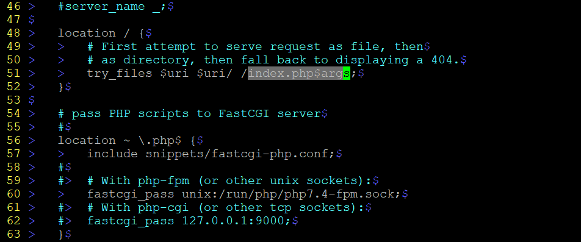

# Task 2
## Content

1. <a href="#a">LAMP stack :  build wordpress webiste</a>
2. <a href="#a">LEMP stack : build wordpress webiste</a>
---
<div id="1"></div>

## 1. LAMP stack :  build wordpress webiste
1. Definition:
> A “LAMP” stack is a group of open-source software that is typically installed together to enable a server to host dynamic websites and web apps. This term is actually an acronym which represents the Linux operating system, with the Apache web server.

> LAMP stand for: Linux, Apache, Mysql, Php.


2. Install

My system information: Parrot OS Security 4.11.2

You can install Lamp Stack on another Linux Distribution.

Step 1: Install required software.
- First you need to update your system
```bash
sudo apt-get update
```
```bash
sudo apt-get upgrade
```
- Install Apache2
```bash
sudo apt-get install apache2
```


- Install Mysql
```bash
sudo apt-get install mariadb-server
```
> mariadb is just a replacement for mysql, because my distro is not support install mysql. 

>If your distro support install mysql, you can you this command below.
```bash
sudo apt-get install mysql-server
```
- Install php

```bash
sudo apt-get install php php-mysql
```
- Start apache
```bash
sudo service apache2 start
```
Enter your machine's ip address in browser.


3. Configure

- Start mysql
```bash
sudo service mysql start
```
- Create database and user
```bash
mysql -u root -p
```

> leave passsword field is none if you haven't config anything.
```bash
create database <database name> default character set utf8 collate utf8 unicode_ci;
```


- Grant privileges:
```bash
grant all privileges on <database name>.* to '<user>'@'localhost' identified by '<user password>';
```


- Flush privileges;
```bash
flush privileges;
```

- Install wordpress. In /var/www/html
```bash
wget https://wordpress.org/latest.tar.gz
```
Unzip file that you downloaded
```bash
tar -xzvf latest.tar.gz
```
- Configure Wordpress

In Wordpress directory, copy file **wp-config**
```bash
cp wp-config-sample.php wp-config.php
```


In config file, replace those information by your database name, username, password, etc.


In **https://api.wordpress.org/secret-key/1.1/salt/**


Scroll down until meet those *define* lines, replace these by all content that you see in the link above.


- Point root directory of apache to wordpress

On **/etc/apache2/sites-available/000-default.conf**, replace **DocumentRoot /var/www/html** by **DocumentRoot /var/www/html/wordpress**

- Restart apache
- Restart web page


> Enter your information and press **Install Wordpress**


> Login Wordpress


>Admin page


> Wordpress website
---
<div id="2"></div>

## 2. LEMP stack : build wordpress webiste
1. Definition 
> LEMP is a variation of the ubiquitous LAMP stack used for developing and deploying web applications. With LEMP, Apache is replaced with the lightweight yet powerful Nginx.

>LEMP stand for: Linux, Nginx, Mysql, Php.


2. Install and Configure
> Installation and configuration of LEMP are pretty much the same with LAMP. There is only few changes

- Install Nginx
```bash
sudo apt-get install nginx
```
Default Nginx web page


- Point root directory of apache to wordpress

On **/etc/nginx/sites-enabled/default**

    - Change root directory (point to wordpress) at line 41
    - Add **index.html** at line 44


    - Replace **index.php$args** at the end of line 51 like this picture below.
    - Uncomment line 56, 57, 60, 63.


- Restart php-fpm
```bash
sudo service php-fpm restart
```


If your OS does has php-fpm, make sure to install it.
```bash
sudo apt-get install php-fpm
```


- Reload your brower and install Wordpress like LAMP.
