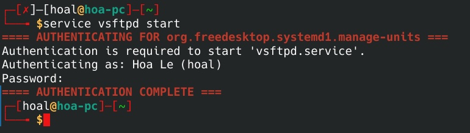
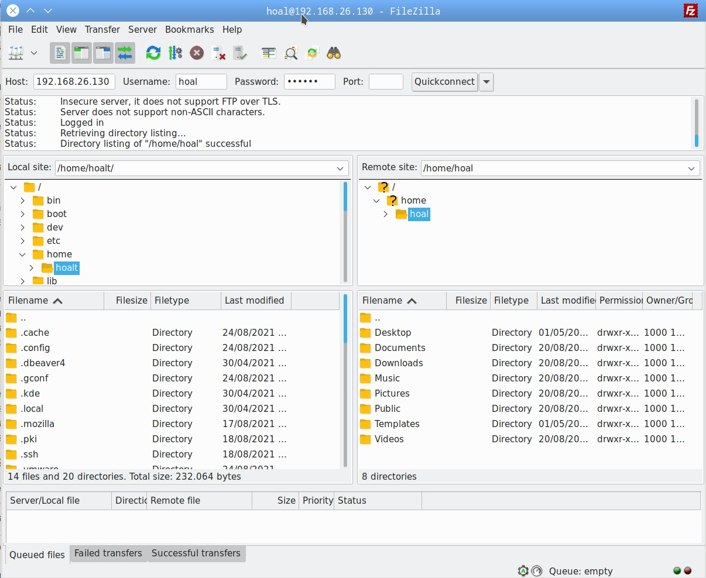
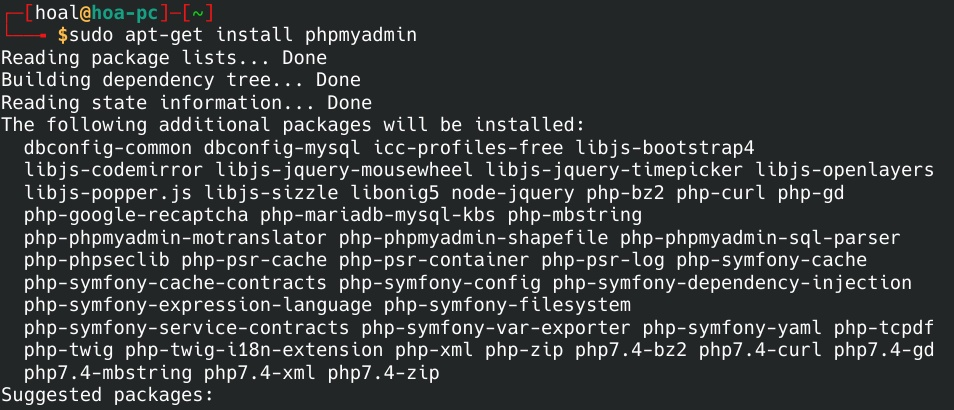

# Task 3
## Content
---
1. <a href="#1">Reverse proxy (nginx)</a>
2. <a href="#2">Remote mysql</a>
3. <a href="#2">vsftpd</a>
4. <a href="#2">phpmyadmin</a>
5. <a href="#2">Build wordpress webiste, allow remote mysql and vsftpd</a>
---
<div id="1"></div>

## Reverse proxy (nginx)


>A Nginx HTTPS reverse proxy is an intermediary proxy service which takes a client request, passes it on to one or more servers, and subsequently delivers the server's response back to the client.

### 1. Download required software: Apache, nginx

```bash
sudo apt-get install apache2
```
```bash
sudo apt-get install nginx
```

- Start Apache
```bash
sudo service apache2 start
```
- In browser, type your machine's ip address, you will see default Apache website.
- Open **Developer tool** and check Response Headers, you'll see Server of this website is **Apache**.


### 2. Configuration
- Change default Apache's port

In **/etc/apache2/sites-available/000-default.conf**, change default port in the first line to 8080 (whatever port you want).


In **/etc/apache2/ports.conf**, change default port in the first line to 8080 (whatever port you want).


Access website through port 8080


- Configure nginx

In **/etc/nginx/sites-available/defaul**, add those lines (from 52 --> 56) and comment line 51. Change to your IP address in line 52.


Restart nginx
```bash
sudo service nginx restart
```

Access website again, in this time, you don't need to specify port number.

Open **Developer tool**, nd check Response Headers, you'll see Server of this website is **nginx**.


---
<div id="2"></div>

## Remote mysql

- Install mysql
```bash
sudo apt-get install mariadb-server
```
I used mariadb because my distro only support **mariadb**, feel free to change to **sudo apt-get install mysql-server** if your distro support it.

- Configure mysql

> By default mysql doesn't allow remote login by root user, so we need to configure those things.

In **/etc/mysql/mariadb.conf.d/50-server.cnf**, comment line **bind-address**


Create new user and grant privileges for it.

> Feel free to use your own user


After that, restart mysql
```bash
sudo service mariadb restart
```

- Remote login with your user credential that you created.


---
<div id="3"><div>

## vsftpd
> vsftpd, is an FTP server for Unix-like systems, including Linux.

- Install vsftpd
```bash
sudo apt-get install vsftpd
```
Start **vsftpd**
 

- Using **FileZilla** to connect to vsftpd server (through port 21).



---
<div id="4"></div>

## phpmyadmin
> phpMyAdmin is a free and open source administration tool for MySQL and MariaDB.
- Install phpmyadmin
```bash
sudo apt-get install myphpadmin
```


While installing, you'll be ask for set up some basic information (database, password)


Type your own password

- Go to **\<your IP address>/phpmyadmin** to access myphpadmin dashboard.

You'll be ask to login, use user that you created in mariadb.


---
<div id="5"></div>

## 5. Configure wordpress

> Setup and configure database, apache like first section of [this part](./Task2/part1.md)

> Make sure to keep **nginx** running as a reverse proxy like the first section of this part.


