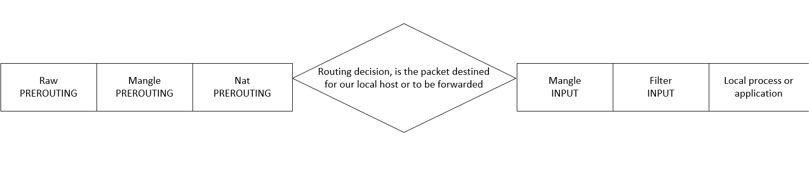
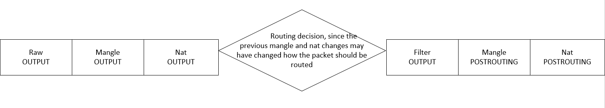
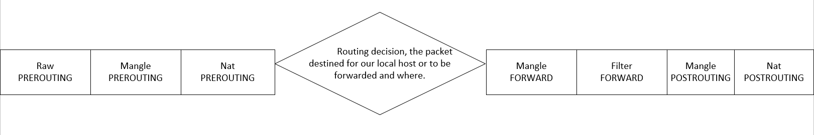
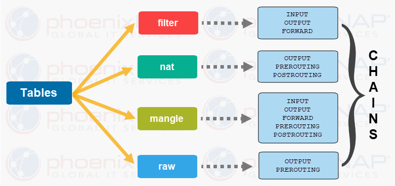

 <link rel="stylesheet" href="styles.css">

# Task 4
## Content
---
1. <a href="#1">iptables</a>
2. <a href="#2">trace</a>
3. <a href="#3">tcpdump</a>
---
<div id="1"></div>

## 1. iptables
- <a href="#a">Definition</a>
- <a href="#b">iptables flow packet diagram</a> 
- <a href="#c">Tables and chains</a>
- <a href="#d">iptables rules</a>

<div id="a"></div>

### **a. Definition**

> iptables is a user-space utility program that allows a system administrator to **configure the IP packet filter rules of the Linux kernel firewall**, implemented as different Netfilter modules. 

>The filters are **organized in different tables**, which **contain chains of rules** for how to treat network traffic packets.

<div id="b"></div>

### **b. iptables flow packet diagram**


- A packet that is destined for our server. It would pass through the following steps before actually being delivered to our application that receives it.


- The outgoing packets from our server.


- The packet is destined for another host on another network.


<div id="c"></div>

### **c. Tables and chains**

> The iptables firewall uses tables to organize its rules. These tables classify rules according to the type of decisions they are used to make.

> Within each iptables table, *rules* are further organized within separate **chains**.

> The structure is: iptables -> Tables -> Chains -> Rules.



> There are four types of table:

- The Filter Table
> Filter is default table for iptables and it is one of the most widely used tables in iptables. The filter table is used to make decisions about whether to let a packet continue to its intended destination or to deny its request. Iptables’s filter table has the following built-in chains:

    - INPUT chain: Incoming to firewall. For packets coming to the local server.
    - OUTPUT chain: Outgoing from firewall. For packets generated locally and going out of the local server.
    - FORWARD chain: Packet for another NIC on the local server. For packets routed through the local server.

- The NAT Table
> The Nat table is used to implement network address translation rules. Iptable’s NAT table has the following built-in chains:

    - PREROUTING chain: Alters packets before routing. Packet translation happens immediately after the packet comes to the system (and before routing). This helps to translate the destination ip address of the packets to something that matches the routing on the local server. This is used for DNAT (destination NAT).

    - POSTROUTING chain: Alters packets after routing. Packet translation happens when the packets are leaving the system. This helps to translate the source ip address of the packets to something that might match the routing on the desintation server.  This is used for SNAT (source NAT).

    - OUTPUT chain: NAT for locally generated packets on the firewall.

- The Mangle Table
> The mangle table is used to alter the IP headers of the packet in various ways. Mangle table has the following built-in chains:

    - PREROUTING chain
    - OUTPUT chain
    - FORWARD chain
    - INPUT chain
    - POSTROUTING chain

- The Raw Table
> The iptables firewall is stateful, meaning that packets are evaluated in regards to their relation to previous packets. 

> The raw table has a very narrowly defined function. Its only purpose is to provide a mechanism for marking packets in order to opt-out of connection tracking. Raw table has the following built-in chains: 

    - PREROUTING chain
    - OUTPUT chain

<div id="d"></div>

### **d. iptables rules**

> Start, stop, restart iptables 
```bash
/etc/init.d/iptables start 
/etc/init.d/iptables stop
/etc/init.d/iptables restart
```

> Basic syntax of iptables
```bash
iptables [-t table] <command> [match] [target/jump]
```
Basic rule command:

- -A, –append: to append a rule to the end of the chain (e.g. -A INPUT)
- -I, –insert: to insert a rule at the specified number (e.g. -I INPUT 1 --dport 80 -j ACCEPT)
- -D, –delete: to delete (either by specifying the whole rule, or a the number of the rule starting with the first rule in the chain being number 1)
- -R, –replace: to replace the rule at the specific line

## **Common usefull rules**
---
> Save IPtables Rules to a File
```bash
iptables-save > ~/iptables.rules
```

> Check your existing rules, use the following command
```bash
iptables -L -n -v
```

> Block Specific IP Address
```bash
iptables -A INPUT -s <IP> -j DROP
```

> Block Specific Port
```bash
iptables -A OUTPUT -p tcp --dport xxx -j DROP
```

> Allow Specific Network Range on Particular Port
```bash
iptables -A OUTPUT -p tcp -d <ip range> --dport xxx -j ACCEPT
```

> Port Forwarding
```bash
iptables -t nat -A PREROUTING -i <interface> -p tcp --dport xxx -j REDIRECT --to-port xxx
```

> Unblock IP Address in IPtables
```bash
iptables -D INPUT -s <IP> -j DROP
```
> Search within IPtables Rule
```bash
iptables -L $table -v -n | grep $string
```

> Block Connection on Network Interface
```bash
iptables -A INPUT -i <interface> -s <IP> -j DROP
```

<div id="2"></div>

## 2. trace
> **traceroute** command in Linux prints the route that a packet takes to reach the host. This command is useful when you want to know about the route and about all the hops that a packet takes.

```bash
traceroute [options]  host_Address [pathlength]
```
Options:

- -4: Use ip version 4 i.e. use IPv4.
- -6: Use ip version 6 i.e. use IPv6.
- -F: Do not fragment packet.
- -f: Start from the first_ttl hop.
- -g: Route the packet through gate.
- -m: Set the max number of hops for the packet to reach the destination.Default value is 30.
- -n: Do not resolve IP addresses to their domain names.
- -p: Set the destination port to use. Default is 33434.
- -q: Set the number of probes per each hop. Default is 3.


---

<div id="3"></div>

## 3. tcpdump

> Tcpdump is a command line utility that allows you to capture and analyze network traffic going through your system. It is often used to help troubleshoot network issues, as well as a security tool.

> Some helpful command for trouble shooting network

- List interfaces are available for capture
```bash
sudo tcpdump -D
```

- Capture all packets in any interface
```bash
sudo tcpdump --interface any
```

- To limit the number of packets captured and stop 
```bash
sudo tcpdump -i any -c <number>
```

- Disable name resolution and port resolution with **--nn**
```
sudo tcpdump -i any -c5 -nn
```

- Filtering packets based on protocol, specifying the protocol in the command line. For example, capture ICMP only.
```bash
sudo tcpdump -i any -c5 icmp
```

- Limit capture to only packets related to a specific host by using the **host** filter
```bash
sudo tcpdump -i any -c5 -nn host <IP address>
```

- To filter packets based on the desired service or port, use the **port** filter.
```bash
sudo tcpdump -i any -c5 -nn port <port number>
```

- Filtering packets based on the source or destination IP Address or hostname.
```bash
sudo tcpdump -i any -c5 -nn src <IP address/Hostname>
```

- Using the dst filter to filter by destination IP/hostname.
```bash
sudo tcpdump -i any -c5 -nn dst <IP address/Hostname>
```

> You can also combine filters by using the logical operators and and or to create more complex expressions. For example:
```bash
sudo tcpdump -i any -c5 -nn src <IP address/Hostname> and port <port number>
```

> Use “-w” option in tcpdump command to save the capture TCP/IP packet to a file. 
```bash
sudo tcpdump -w <file_name.pcap> -i <interface-name>
```
> You can view those file later by Wireshark.